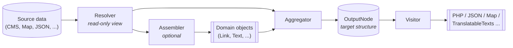

# Aggregator API

The Aggregator API turns CMS source data into new, prepared data structures – for example, for
delivery to frontends, search indexes, or other consumers.

The API is clearly layered. Each role has a well-defined responsibility:

| Role                                        | Purpose                                                 |
|---------------------------------------------|---------------------------------------------------------|
| [**Resolver**](docs/reference/resolver.md)            | Reads raw source data (Source)                          |
| [**Assembler**](docs/reference/assembler.md)          | Builds typed domain objects from a Resolver             |
| [**Aggregator**](docs/reference/aggregator.md)        | Composes the target structure into an OutputNode        |
| [**OutputNode**](docs/reference/output-node.md)       | Hierarchical target data structure (Target)             |
| [**Visitor**](docs/reference/visitor.md)              | Traverses an OutputNode (serialization, analyses)       |

## Data flow



## When do I use what?

| Question                                                              | Answer                                     |
|-----------------------------------------------------------------------|--------------------------------------------|
| How do I get individual values from a source?                         | **Resolver**                               |
| How do I build a typed value object (e.g. `Link`)?                    | **Assembler**                              |
| How do I write results into the target structure?                     | **Aggregator** + **OutputNode**            |
| How do I structure the data hierarchy to be generated?                | **OutputNode** (optionally with sub-aggregators) |
| How do I serialize the result (PHP, JSON, Map) or evaluate it?        | **Visitor**                                |
| How do I deliver the same structure in multiple languages?            | [**Translations**](docs/how-to/translations-pipeline.md)  |

## How it fits together

In a typical aggregation, all roles work together:

```java
public class LinkListAggregator implements Aggregator {

  private final LinkListAssembler linkListAssembler;

  @Override
  public void aggregate(Resolver source, OutputNode output) {
    //                  ^^^^^^^^         ^^^^^^^^^^
    //                  RESOLVER         OUTPUTNODE
    //                  (Source)         (Target)

    linkListAssembler.assemble(LinkListRequest.of(source, options), null)
        //  ^^^^^^^^^
        //  ASSEMBLER returns a typed domain object
        .ifPresent(linkList -> output.put("linkList", linkList));
    //                         ^^^^^^^^^^^^^^^^^^^^^^^^^^^^^^^^
    //                         AGGREGATOR writes into the OutputNode
  }
}
```

Assemblers are optional: for simple fields, an Aggregator can read directly from the Resolver and
write to the OutputNode. Only when constructing a value involves multiple steps (several fields,
derived values, business rules, external resolutions) is a dedicated Assembler worthwhile.

## Documentation at a glance

The documentation is organized by genre:

| Genre         | Directory        | Content                                                                                                            |
|---------------|------------------|---------------------------------------------------------------------------------------------------------------------|
| **Reference** | [`docs/reference/`](docs/reference/) | Role reference: [Resolver](docs/reference/resolver.md), [Assembler](docs/reference/assembler.md), [Aggregator](docs/reference/aggregator.md), [OutputNode](docs/reference/output-node.md), [Visitor](docs/reference/visitor.md) |
| **How-To**    | [`docs/how-to/`](docs/how-to/)       | Task-oriented: [Aggregator plugin project](docs/how-to/aggregator-plugin-project.md), [Assembler customization](docs/how-to/assembler-customization.md), [Translations pipeline](docs/how-to/translations-pipeline.md) |
| **Concept**   | [`docs/concepts/`](docs/concepts/)   | Background & design decisions: [Translatable values: immutability & identity](docs/concepts/translations-rationale.md) |
