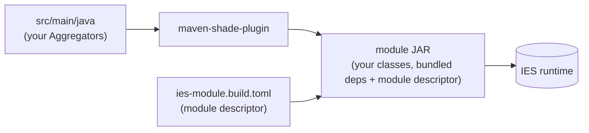

# Setting up an Aggregator Plugin Project

> **Type:** How-To

This document describes how to set up a Maven project that packages your own aggregators as an
**IES module** (plugin) installable into the IES. A working example is the `custom-aggregator`
project.

An *IES-Aggregator package* is an IES module of type `EXTENSION`: a JAR that contributes
[`Aggregator`](../reference/aggregator.md) and [`Assembler`](../reference/assembler.md)
implementations to the runtime. The IES discovers them at startup, so a project can extend or
override the aggregation behaviour without touching the core.

---

## Overview

The build produces two artifacts that together form the installable module:



| Building block                  | Responsibility                                                                 |
|---------------------------------|--------------------------------------------------------------------------------|
| **`ies-module.build.toml`**     | Module descriptor — id, type, version and the compatible IES version range     |
| **`ies-maven-plugin`**          | Provides the `ies:install-module` goal that uploads the built module into a running IES |
| **`maven-shade-plugin`**        | Bundles your runtime dependencies into the JAR so the module is self-contained |
| **`build-helper-maven-plugin`** | Stamps the build timestamp and attaches the descriptor as a separate artifact  |

---

## 1. Project layout

```
custom-aggregator/
├── pom.xml
└── src/
    └── main/
        ├── java/
        │   └── com/sitepark/custom/...     ← your Aggregators / Assemblers
        └── resources/
            └── ies-module.build.toml         ← module descriptor (filtered)
```

---

## 2. The `pom.xml`

### Coordinates and Java version

```xml

<groupId>com.sitepark.custom</groupId>
<artifactId>custom-aggregator</artifactId>
<version>1.0.0-SNAPSHOT</version>
<packaging>jar</packaging>

<properties>
<project.build.sourceEncoding>UTF-8</project.build.sourceEncoding>
<maven.compiler.release>25</maven.compiler.release>
</properties>
```

### Dependencies — `provided` vs. bundled

The decisive question for every dependency is: **does the IES runtime already provide it?**

| Dependency                                     | Scope        | Reason                                                                                    |
|------------------------------------------------|--------------|-------------------------------------------------------------------------------------------|
| `com.sitepark.ies:ies-aggregator`              | **provided** | The Aggregator API is supplied by the IES at runtime — compile against it, do not ship it |
| `jakarta.inject:jakarta.inject-api`            | **provided** | DI annotations (`@Inject`) are provided by the IES container                              |
| Your own libraries (e.g. `sitekit-aggregator`) | *(compile)*  | Not present in the IES → must be **bundled into the module JAR**                          |
| JUnit, Mockito, Hamcrest                       | **test**     | Test-only, never shipped                                                                  |

```xml

<dependencies>
    <dependency>
        <groupId>com.sitepark.ies</groupId>
        <artifactId>ies-aggregator</artifactId>
        <version>1.0.0-SNAPSHOT</version>
        <scope>provided</scope>
    </dependency>

    <!-- A library your aggregators need that the IES does NOT provide.
         Left at the default (compile) scope so the shade plugin bundles it. -->
    <dependency>
        <groupId>com.sitepark.sitekit</groupId>
        <artifactId>sitekit-aggregator</artifactId>
        <version>1.0.0-SNAPSHOT</version>
    </dependency>

    <dependency>
        <groupId>jakarta.inject</groupId>
        <artifactId>jakarta.inject-api</artifactId>
        <version>2.0.1.MR</version>
        <scope>provided</scope>
    </dependency>

    <!-- test dependencies (junit-jupiter, mockito, hamcrest) ... -->
</dependencies>
```

> **Rule of thumb:** everything `provided`/`test` stays out of the JAR; everything `compile`/`runtime`
> is shaded in. Pick the scope deliberately — a `provided` dependency that the IES does *not* actually
> provide leads to `ClassNotFoundException` at runtime, while bundling a library the IES *does* provide
> risks a version clash (see [Shading & Relocation](#5-shading--relocation)).

### Build section

Resource filtering injects the project version and build timestamp into the descriptor:

```xml

<build>
    <resources>
        <resource>
            <filtering>true</filtering>
            <directory>src/main/resources</directory>
            <includes>
                <include>ies-module.build.toml</include>
            </includes>
        </resource>
    </resources>

    <pluginManagement>
        <plugins>
            <plugin>
                <groupId>org.apache.maven.plugins</groupId>
                <artifactId>maven-compiler-plugin</artifactId>
                <version>3.8.1</version>
            </plugin>
            <plugin>
                <groupId>com.sitepark.maven.plugins</groupId>
                <artifactId>ies-maven-plugin</artifactId>
                <version>2.2.0-SNAPSHOT</version>
            </plugin>
        </plugins>
    </pluginManagement>

    <plugins>
        <!-- IES module build conventions -->
        <plugin>
            <groupId>com.sitepark.maven.plugins</groupId>
            <artifactId>ies-maven-plugin</artifactId>
        </plugin>

        <!-- Bundle runtime dependencies into the module JAR -->
        <plugin>
            <groupId>org.apache.maven.plugins</groupId>
            <artifactId>maven-shade-plugin</artifactId>
            <version>3.6.2</version>
            <executions>
                <execution>
                    <phase>package</phase>
                    <goals>
                        <goal>shade</goal>
                    </goals>
                </execution>
            </executions>
        </plugin>

        <!-- Build timestamp + attach the descriptor as a separate artifact -->
        <plugin>
            <groupId>org.codehaus.mojo</groupId>
            <artifactId>build-helper-maven-plugin</artifactId>
            <executions>
                <execution>
                    <id>toml-timestamp-property</id>
                    <goals>
                        <goal>timestamp-property</goal>
                    </goals>
                    <phase>initialize</phase>
                    <configuration>
                        <name>build.toml.timestamp</name>
                        <timeSource>build</timeSource>
                        <pattern>yyyy-MM-dd'T'HH:mm:ss.SSSXXX</pattern>
                        <locale>DE-de</locale>
                        <timeZone>Europe/Berlin</timeZone>
                    </configuration>
                </execution>
                <execution>
                    <id>attach-bin</id>
                    <goals>
                        <goal>attach-artifact</goal>
                    </goals>
                    <phase>package</phase>
                    <configuration>
                        <artifacts>
                            <artifact>
                                <file>target/classes/ies-module.build.toml</file>
                                <classifier>ies-module.build</classifier>
                                <type>toml</type>
                            </artifact>
                        </artifacts>
                        <runOnlyAtExecutionRoot>false</runOnlyAtExecutionRoot>
                    </configuration>
                </execution>
            </executions>
        </plugin>
    </plugins>
</build>
```

---

## 3. The module descriptor `ies-module.build.toml`

This file under `src/main/resources/` identifies the module to the IES. The `${...}` placeholders are
replaced during the filtered resource copy:

```toml
id = "custom-aggregator"
name = "Custom Aggregator"
description = "Custom aggregators"
type = "EXTENSION"
packaging = "jar"
version = "${project.version}"
build_date = ${ build.toml.timestamp }

[ies-dependency]
versions_specification = "[3.26.0-SNAPSHOT, 4.0-SNAPSHOT)"
```

| Field                                     | Meaning                                                                |
|-------------------------------------------|------------------------------------------------------------------------|
| `id`                                      | Unique module id within the IES                                        |
| `type`                                    | `EXTENSION` for an aggregator plugin                                   |
| `packaging`                               | `jar`                                                                  |
| `version` / `build_date`                  | Filled from `${project.version}` and the build-helper timestamp        |
| `[ies-dependency].versions_specification` | Compatible IES version range — the module loads only inside this range |

---

## 4. Implementing an Aggregator

A minimal aggregator reads from the [`Resolver`](../reference/resolver.md) and writes into the
[`OutputNode`](../reference/output-node.md). DI dependencies are injected via `@Inject`:

```java
package com.sitepark.custom;

import com.sitepark.ies.aggregator.Aggregator;
import com.sitepark.ies.aggregator.AggregatorException;
import com.sitepark.ies.aggregator.output.OutputNode;
import com.sitepark.ies.aggregator.resolver.Resolver;
import jakarta.inject.Inject;

public class HeadlineAggregator implements Aggregator {

    @Inject
    HeadlineAggregator() {
    }

    @Override
    public void aggregate(Resolver source, OutputNode output) throws AggregatorException {
        String headline = source.value("sp_title").asString("");
        if (!headline.isBlank()) {
            output.put("headline", headline);
        }
    }
}
```

To contribute reusable, type-driven value builders (and let projects override them), register an
`@AssemblerBinding` instead — see [Extending Assemblers](assembler-customization.md).

---

## 5. Shading & Relocation

The `maven-shade-plugin` bundles every `compile`/`runtime` dependency into the module JAR, so the
module is self-contained when the IES loads it. `provided` and `test` dependencies are excluded — that
is exactly why the IES API and `jakarta.inject` are declared `provided`.

### Why relocation is needed

A module JAR and the IES run on the **same classloader hierarchy**. If your module bundles, say,
Gson 2.8 while the IES already ships Gson 2.10, both copies live under the identical package
`com.google.gson`. The JVM loads a class by its fully-qualified name from whichever JAR comes first
on the classpath — so your code may silently bind against the *other* version. The result is a hard
to-diagnose `NoSuchMethodError` or `LinkageError` at runtime, not at build time.

**Relocation** removes the ambiguity by giving your bundled copy its own, private package name. Two
different package names can never collide, so each side keeps the exact version it was compiled against.

### How relocation works

During the `shade` goal the plugin does **not** recompile or decompile anything. It rewrites the
*bytecode* of the affected `.class` files:

1. It physically moves the class files into the new package folder
   (`com/google/gson/Gson.class` → `com/sitepark/custom/shaded/gson/Gson.class`).
2. It rewrites every reference to those classes in the **constant pool** of *all* bundled classes —
   including your own `HeadlineAggregator` — so the `new`, `invoke*` and type descriptors point at the
   new name.

Because the rename happens at the bytecode level, your *source* code stays untouched: you still
`import com.google.gson.Gson;` and write normal Java. The shade plugin redirects those references
afterwards.

#### Configuration

`pattern` is the original package prefix, `shadedPattern` the private target prefix:

```xml

<plugin>
    <groupId>org.apache.maven.plugins</groupId>
    <artifactId>maven-shade-plugin</artifactId>
    <version>3.6.2</version>
    <executions>
        <execution>
            <phase>package</phase>
            <goals>
                <goal>shade</goal>
            </goals>
            <configuration>
                <relocations>
                    <relocation>
                        <pattern>com.google.gson</pattern>
                        <shadedPattern>com.sitepark.custom.shaded.gson</shadedPattern>
                    </relocation>
                </relocations>
                <!-- Adjust META-INF/services entries for relocated SPIs -->
                <transformers>
                    <transformer
                            implementation="org.apache.maven.plugins.shade.resource.ServicesResourceTransformer"/>
                </transformers>
            </configuration>
        </execution>
    </executions>
</plugin>
```

#### Before / after on the bytecode

Your source — unchanged in both cases:

```java
import com.google.gson.Gson;

Gson gson = new Gson();
```

Compiled bytecode **before** relocation (constant pool references the original name):

```
0: new           #7   // class com/google/gson/Gson
3: invokespecial #9   // Method com/google/gson/Gson."<init>":()V

Constant pool:
  #7 = Class      com/google/gson/Gson
  #9 = Methodref  com/google/gson/Gson."<init>":()V
```

**After** relocation (the same instructions now point at the private package):

```
0: new           #7   // class com/sitepark/custom/shaded/gson/Gson
3: invokespecial #9   // Method com/sitepark/custom/shaded/gson/Gson."<init>":()V

Constant pool:
  #7 = Class      com/sitepark/custom/shaded/gson/Gson
  #9 = Methodref  com/sitepark/custom/shaded/gson/Gson."<init>":()V
```

And the JAR layout reflects the move:

```
custom-aggregator-1.0.0-SNAPSHOT.jar
├── com/sitepark/custom/HeadlineAggregator.class   ← references ...shaded.gson.Gson
└── com/sitepark/custom/shaded/gson/Gson.class      ← the relocated Gson 2.8 copy
```

### Limits: what relocation does *not* rewrite

Relocation works on bytecode references — it cannot see class names that exist only as **strings**:

- **Reflection** — `Class.forName("com.google.gson.Gson")` keeps the old string and fails after
  relocation. Such lookups must be adjusted by hand to the shaded name.
- **`META-INF/services` (SPI)** — service-provider files list implementation class names as text.
  Add the `ServicesResourceTransformer` (shown above) so the plugin rewrites those entries too.
- **Resources referencing class names** (config files, XML, properties) are likewise not touched.

> **Scope relocation narrowly.** Only relocate libraries that actually risk a clash with what the IES
> already ships. Relocating the IES API itself would break the contract with the runtime, so the API
> stays `provided` and is never bundled, let alone relocated.

---

## 6. Build and install

### Build only

```bash
mvn clean package
```

The `package` phase produces the shaded **module JAR**
(`custom-aggregator-1.0.0-SNAPSHOT.jar`) under `target/`, containing your classes, the bundled
dependencies and the module descriptor. Because version and timestamp are filtered in at build time,
the descriptor always matches the JAR it ships with.

### Build and deploy to the IES

The `ies-maven-plugin` adds the `ies:install-module` goal, which uploads the freshly built module
straight into a running IES. Append it to the build:

```bash
mvn -P custom clean package ies:install-module
```

The `-P custom` activates a profile that carries the connection details of the target IES. Keep
those credentials out of the project and define the profile in your **`~/.m2/settings.xml`**:

```xml
<profile>
    <id>custom</id>
    <properties>
        <!-- IES -->
        <ies.connection.url>https://custom.mydevserver.loc</ies.connection.url>
        <ies.connection.admin.user>manager</ies.connection.admin.user>
        <ies.connection.admin.password>mypassword</ies.connection.admin.password>
    </properties>
</profile>
```

`ies:install-module` reads these `ies.connection.*` properties, connects to the IES at
`ies.connection.url` and installs the module. The profile id (`custom`) is arbitrary — match it with
the `-P` argument. Define one profile per target environment (e.g. local, staging) and pick it via
`-P`.

> **Never commit credentials.** The connection data belongs in your personal `~/.m2/settings.xml`,
> not in the project `pom.xml`.

---

## Checklist

- [ ] `ies-aggregator` and `jakarta.inject-api` are `provided`
- [ ] Project-only libraries are `compile` scope so they get shaded in
- [ ] `ies-module.build.toml` exists, is resource-**filtered**, and declares the IES version range
- [ ] `maven-shade-plugin`, `ies-maven-plugin` and `build-helper-maven-plugin` are configured
- [ ] Bundled libraries that risk version clashes are **relocated**
- [ ] Reflection / `META-INF/services` references to relocated classes are adjusted
- [ ] `mvn clean package` produces the shaded module JAR
- [ ] An IES profile with `ies.connection.*` properties exists in `~/.m2/settings.xml`
- [ ] `mvn -P <profile> clean package ies:install-module` installs the module into the IES
