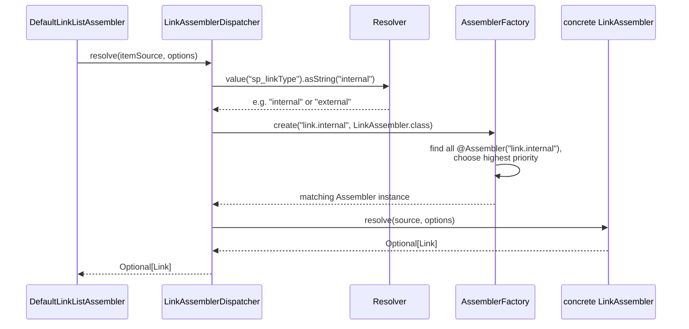

# Extending Assemblers

> **Type:** How-To

This document describes three patterns that allow assemblers to be extended or overridden per
project without changes to the core code. Patterns 1 and 2 are based on `@Assembler` and
`AssemblerFactory`; Pattern 3 adds project-specific fields to the produced model.

| Pattern                                    | When to use                                                                                               |
|--------------------------------------------|-----------------------------------------------------------------------------------------------------------|
| **Pattern 1: Type-driven dispatching**     | Multiple implementations for different types; which one applies is only determined at runtime in the Resolver |
| **Pattern 2: Assembler chain**             | One or more implementations per key; each runs in turn and may enrich or replace the previous result      |
| **Pattern 3: Additional model fields**     | A value type must carry extra, project-specific fields without changing the core record                   |

---

## Core principle: chaining, not delegation

All built-in assembler implementations are `final`. Projects **never extend an assembler to
customize it** — instead, all assemblers registered under a key form a **chain**. The caller obtains
the whole chain via `AssemblerFactory.createChain(key, type)` and threads the assembled value through
it: the first assembler produces the base value, and every following assembler receives the previous
result as its last `previous` parameter and returns the next result.

- **Ordering is by priority, ascending.** The built-in (`priority = 0`) runs first and produces the
  base value; a project assembler registered with a higher priority (e.g. `100`) runs afterwards and
  receives the built-in's result as `previous`. Higher priority therefore means "runs later / has the
  last word".
- **Enrich or replace.** `previous` is a `@Nullable` value (null for the first assembler). One that
  returns `Optional.ofNullable(previous).map(v -> v.extend(...))` (or a rebuilt copy) *enriches* the
  value; one that ignores `previous` and returns its own value *replaces* it.
- **Running the chain.** `createChain` returns an `AssemblerChain<T>` — iterate it, or (for a uniform
  `assemble` shape) call `chain.fold((assembler, previous) -> assembler.assemble(..., previous))`,
  which threads the value through and returns the final `Optional`.
- **No delegate injection.** Because the previous result arrives as a parameter, an override never
  injects the concrete `Default…` class and never re-enters the factory for the same key. The
  extension point stays an **interface** (`LinkAssembler`, `LinkListAssembler`, …); the built-in is a
  `final` implementation of it, and the interface is what `createChain` dispatches on.
- **Pruning the chain.** Two `@Assembler` attributes skip assemblers that would otherwise run (they
  are neither executed nor instantiated):
  - `chainRoot = true` — this assembler builds a fresh value from scratch, so every assembler with a
    **lower** priority is skipped. If several roots exist, the highest-priority one wins.
  - `chainBreak = true` — this assembler must run last, so every assembler with a **higher** priority
    is skipped. If several are marked, the lowest-priority one wins.

  A `chainBreak` below a `chainRoot` leaves an empty window; the chain is then empty.

> `AssemblerFactory.create(key, type)` still exists and returns the single highest-priority assembler.
> It is used for genuine single-selection (e.g. resolving one link *type* in Pattern 1), not for
> chaining.

---

## Pattern 1: Type-driven dispatching

### Overview

An aggregation run must build objects of different types from the same source data. A type field in
the Resolver determines at runtime which assembler is chosen. At the same time, customer projects
should be able to add new types or replace existing implementations.

The solution consists of three building blocks:

| Building block            | Responsibility                                                            |
|---------------------------|----------------------------------------------------------------------------|
| **Type field in Resolver**| Determines at runtime which assembler is chosen                           |
| **`@Assembler`**          | Registers a class under a unique key                                       |
| **`AssemblerFactory`**    | Resolves the key, returns the implementation with the highest priority     |

### Architecture

Using the Link assembler family as an example:



### Classes involved

**`LinkAssembler<T extends Link>`** — the common interface of all Link assemblers:

```java
public interface LinkAssembler<T extends Link> {
    Optional<T> assemble(Resolver source, LinkOptions options, @Nullable T previous);
}
```

**`LinkAssemblerDispatcher`** — the central dispatcher. It reads the type from the Resolver, builds
the key, and runs the chain registered for that type:

```java
public class LinkAssemblerDispatcher {

    private final AssemblerFactory assemblerFactory;

    @Inject
    LinkAssemblerDispatcher(AssemblerFactory assemblerFactory) {
        this.assemblerFactory = assemblerFactory;
    }

    @SuppressWarnings({"unchecked", "rawtypes"})
    public Optional<? extends Link> assemble(Resolver source, LinkOptions options) {
        String linkType = source.value("sp_linkType").asString("internal");
        @Nullable Link link = null;
        for (LinkAssembler assembler :
                this.assemblerFactory.createChain("link." + linkType, LinkAssembler.class)) {
            link = assembler.assemble(source, options, link).orElse(null);
        }
        return Optional.ofNullable(link);
    }
}
```

**`InternalLinkAssembler`** — the built-in assembler for internal links, registered under
`"link.internal"` with the default priority 0:

```java

@Assembler("link.internal")
public final class InternalLinkAssembler implements LinkAssembler<Link.InternalLink> {

    @Inject
    InternalLinkAssembler(ChannelUriProvider uriProvider, ChannelProvider channelProvider,
                          HeadlineAssembler headlineAssembler) { ...}

    @Override
    public Optional<Link.InternalLink> assemble(
            Resolver source, LinkOptions options, Link.@Nullable InternalLink previous) {
        // built-in producer: reads sp_link.link, sp_linkText, sp_linkNewWindow, ... (ignores previous)
    }
}
```

**`Link`** — the interface that all link types must implement in common. Concrete types
are Java records:

```java
public interface Link {
    String modelType();

    Uri url();

    Text label();

    boolean newWindow();

    record InternalLink(
            String modelType,
            int iesId,
            String objectType,
            String resourceUrl,
            Uri url,
            Text label,
            boolean newWindow)
            implements Link {
    }
}
```

### Use case 1: Adding a new link type

A new link type (e.g. `"external"` for external URLs) requires three steps.

**Step 1:** Add a new record in `Link.java`:

```java
public interface Link {
    // ... existing methods and records ...

    record ExternalLink(
            String modelType,
            Uri url,
            Text label,
            boolean newWindow)
            implements Link {
    }
}
```

**Step 2:** Implement the assembler and register it with the matching key. The key
must match the pattern `"link." + sp_linkType`:

```java

@Assembler("link.external")
public final class ExternalLinkAssembler implements LinkAssembler<Link.ExternalLink> {

    @Inject
    public ExternalLinkAssembler() {
    }

    @Override
    public Optional<Link.ExternalLink> assemble(
            Resolver source, LinkOptions options, Link.@Nullable ExternalLink previous) {
        String rawUrl = source.value("sp_externalUrl").asString("");
        if (rawUrl.isBlank()) {
            return Optional.empty();
        }

        Uri url = Uri.of(rawUrl);
        Text label = source.value("sp_linkText").asText(PlainText.EMPTY).translatable();
        boolean newWindow = source.value("sp_linkNewWindow").asBoolean(true);

        return Optional.of(new Link.ExternalLink("content.link.external", url, label, newWindow));
    }
}
```

**Step 3:** In the CMS object, set the `sp_linkType` field to `"external"`. The
`LinkAssemblerDispatcher` then automatically routes to the `ExternalLinkAssembler` — no
further code change needed.

### Use case 2: Overriding an existing link type

To customize a built-in per project, register under the same key with a **higher priority**. The
built-in `InternalLinkAssembler` has `priority = 0` (default); the project assembler uses
`priority = 100` and runs after it in the chain, receiving the built-in's result as `previous`:

```java

@Assembler(value = "link.internal", priority = 100)
public final class ProjectInternalLinkAssembler implements LinkAssembler<Link.InternalLink> {

    private final ProjectLinkEnricher enricher;    // project-specific extension

    @Inject
    public ProjectInternalLinkAssembler(ProjectLinkEnricher enricher) {
        this.enricher = enricher;
    }

    @Override
    public Optional<Link.InternalLink> assemble(
            Resolver source, LinkOptions options, Link.@Nullable InternalLink previous) {
        // enrich the built-in's result...
        return Optional.ofNullable(previous).map(link -> this.enricher.enrich(link, source));
    }
}
```

Because the override runs after the built-in and receives its result as `previous`, it neither
injects the concrete `Default…` class nor re-enters the factory. To *replace* the built-in entirely
instead of enriching it, ignore `previous` and build your own value — or mark the override
`@Assembler(value = "link.internal", priority = 100, chainRoot = true)` so the built-in is not even
executed.

---

## Pattern 2: Assembler chain

### Overview

There is one built-in assembler for a task — no type field in the Resolver, no dispatch. Customer
projects can replace or extend it without touching the Aggregator by registering further assemblers
under the same key; all of them run in a chain.

The Aggregator does not inject the assembler itself, but the `AssemblerFactory`. For each aggregation
run it obtains the whole chain by key via `createChain` and threads the value through it. Which
classes take part, and in which order, is decided by the factory from the registered `@Assembler`
annotations and their priority.

### Setup

Using `LinkListAssembler` and `LinkListAggregator` as an example.

The extension point is the **`LinkListAssembler` interface**; the built-in **implementation** is
`final` and registered with `@Assembler`:

```java
public interface LinkListAssembler {
    Optional<LinkList> assemble(
            Resolver source, LinkListOptions options, @Nullable LinkList previous);
}

@Assembler("linkList")
public final class DefaultLinkListAssembler implements LinkListAssembler {

    private final LinkAssemblerDispatcher linkAssembler;
    private final AggregatorErrorHandler errorHandler;

    @Inject
    public DefaultLinkListAssembler(LinkAssemblerDispatcher linkAssembler,
                                    AggregatorErrorHandler errorHandler) {
        this.linkAssembler = linkAssembler;
        this.errorHandler = errorHandler;
    }

    @Override
    public Optional<LinkList> assemble(
            Resolver source, LinkListOptions options, @Nullable LinkList previous) {
        // built-in producer: ignores previous and builds the base value
        Text headline = source.value("sp_headline").asText(PlainText.EMPTY).translatable();
        String boxType = source.value("sp_linkBoxType").asString(options.box().defaultType());
        List<Link> items = resolveItemList(source, options.linkOptions());
        if (items.isEmpty()) {
            return Optional.empty();
        }
        return Optional.of(new LinkList("content.linkList", headline, boxType, items));
    }
}
```

The **aggregator** obtains the chain per run via the factory and folds the value through it:

```java
public class LinkListAggregator implements Aggregator, OptionsAware<LinkListOptions> {

    private final AssemblerFactory assemblerFactory;
    private LinkListOptions options;

    @Inject
    public LinkListAggregator(AssemblerFactory assemblerFactory) {
        this.assemblerFactory = assemblerFactory;
    }

    @Override
    public void aggregate(Resolver source, OutputNode output) throws AggregatorException {
        this.assemblerFactory
                .createChain("linkList", LinkListAssembler.class)
                .fold((assembler, previous) -> assembler.assemble(source, this.options, previous))
                .ifPresent(linkList -> output.put("model", linkList));
    }
}
```

> `createChain` returns an `AssemblerChain<LinkListAssembler>`. Its `fold` threads the value through
> the chain — starting from `null`, each assembler receives the previous result and returns the next.
> Callers whose `assemble` has a different shape (extra parameters, no options) iterate the chain
> instead.

### Override in a customer project

An implementation of `LinkListAssembler` with a higher priority runs after the built-in — without any
change to `LinkListAggregator`. Instead of injecting the built-in as a delegate, it receives the
built-in's result as `previous` and enriches it:

```java

@Assembler(value = "linkList", priority = 100)
public final class ProjectLinkListAssembler implements LinkListAssembler {

    private final ProjectTeaser teaser;

    @Inject
    public ProjectLinkListAssembler(ProjectTeaser teaser) {
        this.teaser = teaser;
    }

    @Override
    public Optional<LinkList> assemble(
            Resolver source, LinkListOptions options, @Nullable LinkList previous) {
        // enrich the built-in's result, or ignore previous to replace it entirely
        return Optional.ofNullable(previous).map(list -> enrich(list, source));
    }

    private LinkList enrich(LinkList list, Resolver source) {
        // project-specific enrichment
        ...
    }
}
```

> The built-in's result arrives as `previous`, so the override neither injects `DefaultLinkListAssembler`
> nor calls the factory — the chain has already run the built-in before this assembler. To skip the
> built-in altogether (e.g. this override builds its own value from scratch), add `chainRoot = true`
> to its `@Assembler`.

---

## Pattern 3: Additional model fields

### Overview

Patterns 1 and 2 let a project decide *which* assembler runs. But the value types an assembler
produces are **final Java records** — a customer override can return a record, yet it cannot add a
field to an existing record type (records cannot be subclassed).

To add project-specific fields **without changing the core record**, a value type exposes an
extension slot annotated with `@OutputUnwrapped`. The slot is a `List<Object>`, and the
`DomainObjectMapper` inlines **every element's** sub-properties **flat, at the top level** of the
model (see [Visitor → Flattening properties](../reference/visitor.md)). Because it is a list, several
independent modules can each append their own extension and have all of them rendered side by side;
on a key collision the extension added last wins. An empty list contributes nothing — no dangling
`extensions` key is rendered.

### Convention: an `Extensible` base interface

Consumer projects typically introduce a small base interface so every model carries the slot
uniformly:

```java
public interface Extensible {
    List<Object> extensions();
}
```

A value record adds the slot as a component annotated `@OutputUnwrapped`, defensively copies the list
in a compact constructor, and offers an `extend(Object)` wither returning an immutable copy with one
more extension **appended** — no key annotation, because the slot's own key is dropped during
inlining and the component name is never rendered:

```java
@OutputType("content.linkList")
public record LinkList(
        Text headline,
        String linkBoxType,
        List<Link> items,
        @OutputUnwrapped List<Object> extensions)
        implements Extensible {

    public LinkList {
        extensions = List.copyOf(extensions);
    }

    /** Creates a link list without any customer extension. */
    public LinkList(Text headline, String linkBoxType, List<Link> items) {
        this(headline, linkBoxType, items, List.of());
    }

    /** Returns a copy with the given customer extension appended. */
    public LinkList extend(Object extension) {
        List<Object> combined = new ArrayList<>(this.extensions);
        combined.add(extension);
        return new LinkList(headline, linkBoxType, items, combined);
    }
}
```

The built-in assembler uses the convenience constructor, so it starts with an empty extension list
(contributes nothing — no dangling key):

```java
return Optional.of(new LinkList(headline, boxType, items));
```

### Adding fields in a customer project

Combine with Pattern 2: register an override under the same key with a higher priority and **append**
a typed extension object to the `previous` value with `extend(...)`:

```java
public record LinkListBadge(String label, int count) {
}

@Assembler(value = "linkList", priority = 100)
public final class ProjectLinkListAssembler implements LinkListAssembler {

    @Override
    public Optional<LinkList> assemble(
            Resolver source, LinkListOptions options, @Nullable LinkList previous) {
        return Optional.ofNullable(previous)
                .map(list -> list.extend(new LinkListBadge("new", list.items().size())));
    }
}
```

The model then renders with `label` and `count` as **top-level** fields next to `headline`, …
instead of nested under an `extensions` key. Because the override *appends* instead of rebuilding the
record, any extension a **lower**-priority assembler already attached survives — each layer adds to
the list, and all layers are rolled out flat.

> **Note:** the slot is typed `List<Object>` so it accepts any mix of extension payloads. Each
> element may be a record, a bean or a `Map`; `@OutputUnwrapped` on the list is inlined element-wise
> by the introspecting `JacksonDomainObjectMapper`, even though plain Jackson *serialization* only
> supports unwrapping on concrete bean types.

---

## Important notes

### `AssemblerFactory` creates a fresh instance per call

Both `assemblerFactory.create(key, clazz)` and every element of `createChain(key, clazz)` are
**fresh instances**. Assemblers may therefore hold state in fields without having to worry about
thread safety or run isolation.

### Dependency Injection via `@Inject`

Assemblers are instantiated by the DI container. Dependencies are declared in the constructor
and wired in via `@Inject`. No manual wiring is needed, as long as the dependencies are registered
in the DI container.

### Fault tolerance in list processing

The `DefaultLinkListAssembler` catches `AggregatorException` errors individually per list item and forwards
them to the `AggregatorErrorHandler`. A single failed link does not abort the
entire list:

```java
void example() {
    for (Resolver itemSource : source.resolveList("sp_link_iterate")) {

        try {
            this.linkAssembler.assemble(itemSource, options).ifPresent(items::add);

        } catch (AggregatorException e) {
            this.errorHandler.handle(e); // logs, skips this item
        }
    }
}
```

Custom assemblers can throw `AggregatorException` when a required field is missing or a value
is invalid — the caller decides how to handle it.

### Both patterns can be combined

Pattern 1 and Pattern 2 are not mutually exclusive. In the Link assembler family, Pattern 1 is
already active (`LinkAssemblerDispatcher`). If Pattern 2 is additionally applied to `LinkListAssembler`,
a customer project can override both individual link types and the entire list logic independently
of one another.
