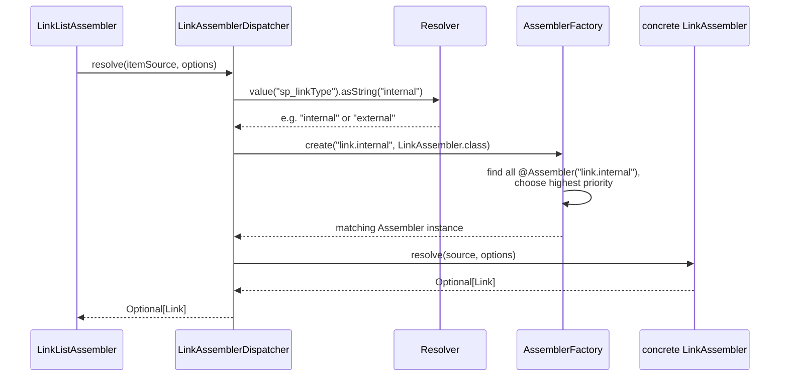

# Extending Assemblers

> **Type:** How-To

This document describes two patterns that allow assemblers to be extended or overridden per project
without changes to the core code. Both patterns are based on `@Assembler` and `AssemblerFactory`.

| Pattern                                    | When to use                                                                                               |
|--------------------------------------------|-----------------------------------------------------------------------------------------------------------|
| **Pattern 1: Type-driven dispatching**     | Multiple implementations for different types; which one applies is only determined at runtime in the Resolver |
| **Pattern 2: Direct override**             | Exactly one implementation; customer projects should be able to replace or extend it                      |

---

## Pattern 1: Type-driven dispatching

### Overview

An aggregation run must build objects of different types from the same source data. A type field in
the Resolver determines at runtime which assembler is chosen. At the same time, customer projects
should be able to add new types or replace existing implementations.

The solution consists of three building blocks:

| Building block            | Responsibility                                                            |
|---------------------------|----------------------------------------------------------------------------|
| **Type field in Resolver**| Determines at runtime which assembler is chosen                           |
| **`@Assembler`**          | Registers a class under a unique key                                       |
| **`AssemblerFactory`**    | Resolves the key, returns the implementation with the highest priority     |

### Architecture

Using the Link assembler family as an example:



### Classes involved

**`LinkAssembler<T extends Link>`** — the common interface of all Link assemblers:

```java
public interface LinkAssembler<T extends Link> {
    Optional<T> assemble(Resolver source, LinkOptions options);
}
```

**`LinkAssemblerDispatcher`** — the central dispatcher. It reads the type from the Resolver,
builds the key, and delegates to the factory:

```java
public class LinkAssemblerDispatcher {

    private final AssemblerFactory assemblerFactory;

    @Inject
    LinkAssemblerDispatcher(AssemblerFactory assemblerFactory) {
        this.assemblerFactory = assemblerFactory;
    }

    public Optional<? extends Link> assemble(Resolver source, LinkOptions options) {
        String linkType = source.value("sp_linkType").asString("internal");
        LinkAssembler<?> assembler =
                this.assemblerFactory.create("link." + linkType, LinkAssembler.class);
        return assembler.assemble(source, options);
    }
}
```

**`InternalLinkAssembler`** — the built-in assembler for internal links, registered under
`"link.internal"` with the default priority 0:

```java

@Assembler("link.internal")
public class InternalLinkAssembler implements LinkAssembler<Link.InternalLink> {

    @Inject
    InternalLinkAssembler(ChannelUriProvider uriProvider, ChannelProvider channelProvider,
                          HeadlineAssembler headlineAssembler) { ...}

    @Override
    public Optional<Link.InternalLink> assemble(Resolver source, LinkOptions options) {
        // reads sp_link.link, sp_linkText, sp_linkNewWindow, ...
    }
}
```

**`Link`** — the interface that all link types must implement in common. Concrete types
are Java records:

```java
public interface Link {
    String modelType();

    Uri url();

    Text label();

    boolean newWindow();

    record InternalLink(
            @JsonProperty("modelType") String modelType,
            @JsonProperty("iesId") int iesId,
            @JsonProperty("objectType") String objectType,
            @JsonProperty("resourceUrl") String resourceUrl,
            @JsonProperty("url") Uri url,
            @JsonProperty("label") Text label,
            @JsonProperty("newWindow") boolean newWindow)
            implements Link {
    }
}
```

### Use case 1: Adding a new link type

A new link type (e.g. `"external"` for external URLs) requires three steps.

**Step 1:** Add a new record in `Link.java`:

```java
public interface Link {
    // ... existing methods and records ...

    record ExternalLink(
            @JsonProperty("modelType") String modelType,
            @JsonProperty("url") Uri url,
            @JsonProperty("label") Text label,
            @JsonProperty("newWindow") boolean newWindow)
            implements Link {
    }
}
```

**Step 2:** Implement the assembler and register it with the matching key. The key
must match the pattern `"link." + sp_linkType`:

```java

@Assembler("link.external")
public class ExternalLinkAssembler implements LinkAssembler<Link.ExternalLink> {

    @Inject
    public ExternalLinkAssembler() {
    }

    @Override
    public Optional<Link.ExternalLink> assemble(Resolver source, LinkOptions options) {
        String rawUrl = source.value("sp_externalUrl").asString("");
        if (rawUrl.isBlank()) {
            return Optional.empty();
        }

        Uri url = Uri.of(rawUrl);
        Text label = source.value("sp_linkText").asText(PlainText.EMPTY).translatable();
        boolean newWindow = source.value("sp_linkNewWindow").asBoolean(true);

        return Optional.of(new Link.ExternalLink("content.link.external", url, label, newWindow));
    }
}
```

**Step 3:** In the CMS object, set the `sp_linkType` field to `"external"`. The
`LinkAssemblerDispatcher` then automatically routes to the `ExternalLinkAssembler` — no
further code change needed.

### Use case 2: Overriding an existing link type

To replace a built-in implementation per project, the same key is used with a
**higher priority**. The built-in `InternalLinkAssembler` has `priority = 0`
(default). An override implementation uses `priority = 100`:

```java

@Assembler(value = "link.internal", priority = 100)
public class ProjectInternalLinkAssembler implements LinkAssembler<Link.InternalLink> {

    private final ChannelUriProvider uriProvider;
    private final ChannelProvider channelProvider;
    private final HeadlineAssembler headlineAssembler;
    private final ProjectLinkEnricher enricher;    // project-specific extension

    @Inject
    public ProjectInternalLinkAssembler(
            ChannelUriProvider uriProvider,
            ChannelProvider channelProvider,
            HeadlineAssembler headlineAssembler,
            ProjectLinkEnricher enricher) {
        this.uriProvider = uriProvider;
        this.channelProvider = channelProvider;
        this.headlineAssembler = headlineAssembler;
        this.enricher = enricher;
    }

    @Override
    public Optional<Link.InternalLink> assemble(Resolver source, LinkOptions options) {
        // custom logic, e.g. read additional fields or resolve the channel differently
        ...
    }
}
```

The `AssemblerFactory` automatically selects this class because its `priority` value is higher. The
built-in implementation remains unchanged on the classpath but is no longer used.

---

## Pattern 2: Direct override

### Overview

There is exactly one assembler for a task — no type field in the Resolver, no dispatch. Nonetheless,
customer projects can replace or extend the assembler without touching the Aggregator.

The crucial difference from direct DI: the Aggregator does not inject the assembler itself,
but the `AssemblerFactory`. For each aggregation run, it obtains a fresh instance by key. Which
concrete class is returned is decided by the factory based on the registered
`@Assembler` annotations and their priority.

### Setup

Using `LinkListAssembler` and `LinkListAggregator` as an example.

The **assembler** is registered with `@Assembler`:

```java

@Assembler("linkList")
public class LinkListAssembler {

    private final LinkAssemblerDispatcher linkAssembler;
    private final AggregatorErrorHandler errorHandler;

    @Inject
    public LinkListAssembler(LinkAssemblerDispatcher linkAssembler,
                             AggregatorErrorHandler errorHandler) {
        this.linkAssembler = linkAssembler;
        this.errorHandler = errorHandler;
    }

    public Optional<LinkList> assemble(Resolver source, LinkListOptions options) {
        Text headline = source.value("sp_headline").asText(PlainText.EMPTY).translatable();
        String boxType = source.value("sp_linkBoxType").asString(options.box().defaultType());
        List<Link> items = resolveItemList(source, options.linkOptions());
        if (items.isEmpty()) {
            return Optional.empty();
        }
        return Optional.of(new LinkList("content.linkList", headline, boxType, items));
    }
}
```

The **aggregator** obtains the assembler per run via the factory:

```java
public class LinkListAggregator implements Aggregator, OptionsAware<LinkListOptions> {

    private final AssemblerFactory assemblerFactory;
    private LinkListOptions options;

    @Inject
    public LinkListAggregator(AssemblerFactory assemblerFactory) {
        this.assemblerFactory = assemblerFactory;
    }

    @Override
    public void aggregate(Resolver source, OutputNode output) throws AggregatorException {
        LinkListAssembler linkListAssembler =
                this.assemblerFactory.create("linkList", LinkListAssembler.class);
        linkListAssembler.assemble(source, this.options)
                .ifPresent(linkList -> output.put("model", linkList));
    }
}
```

### Override in a customer project

A subclass with a higher priority value automatically takes control — without any change
to `LinkListAggregator`:

```java

@Assembler(value = "linkList", priority = 100)
public class ProjectLinkListAssembler extends LinkListAssembler {

    private final ProjectTeaser teaser;

    @Inject
    public ProjectLinkListAssembler(LinkAssemblerDispatcher linkAssembler,
                                    AggregatorErrorHandler errorHandler,
                                    ProjectTeaser teaser) {
        super(linkAssembler, errorHandler);
        this.teaser = teaser;
    }

    @Override
    public Optional<LinkList> assemble(Resolver source, LinkListOptions options) {
        // call the base implementation and enrich the result, or replace it entirely
        return super.assemble(source, options).map(list -> enrich(list, source));
    }

    private LinkList enrich(LinkList list, Resolver source) {
        // project-specific enrichment
        ...
    }
}
```

---

## Important notes

### `AssemblerFactory` creates a fresh instance per call

Every call to `assemblerFactory.create(key, clazz)` returns a **fresh instance**. Assemblers
may therefore hold state in fields without having to worry about thread safety or run
isolation.

### Dependency Injection via `@Inject`

Assemblers are instantiated by the DI container. Dependencies are declared in the constructor
and wired in via `@Inject`. No manual wiring is needed, as long as the dependencies are registered
in the DI container.

### Fault tolerance in list processing

The `LinkListAssembler` catches `AggregatorException` errors individually per list item and forwards
them to the `AggregatorErrorHandler`. A single failed link does not abort the
entire list:

```java
void example() {
    for (Resolver itemSource : source.resolveList("sp_link_iterate")) {

        try {
            this.linkAssembler.assemble(itemSource, options).ifPresent(items::add);

        } catch (AggregatorException e) {
            this.errorHandler.handle(e); // logs, skips this item
        }
    }
}
```

Custom assemblers can throw `AggregatorException` when a required field is missing or a value
is invalid — the caller decides how to handle it.

### Both patterns can be combined

Pattern 1 and Pattern 2 are not mutually exclusive. In the Link assembler family, Pattern 1 is
already active (`LinkAssemblerDispatcher`). If Pattern 2 is additionally applied to `LinkListAssembler`,
a customer project can override both individual link types and the entire list logic independently
of one another.
