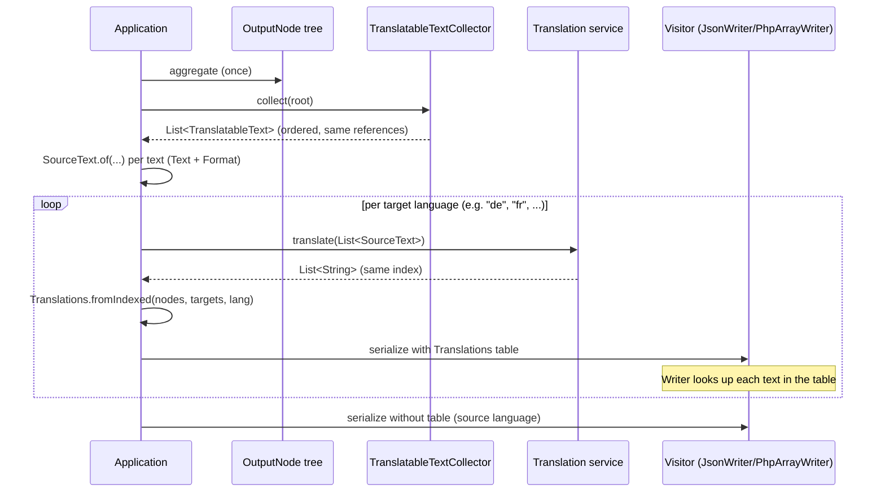

# Translation Pipeline

> **Type:** How-To
> **Goal:** Deliver the same target structure in multiple languages without re-aggregating
> per language.

## What is it for?

An aggregator builds the target structure **once** as an OutputNode tree. This structure often needs
to be delivered in **multiple languages** without re-aggregating it per language. To achieve this,
individual texts are not stored as plain strings but as **translatable values**
(`TranslatableText` & co.). They carry their source text and serve as identity keys into an
external translation table.

The tree itself is **immutable**: the translation does not live in the tree but in a separate
`Translations` table per language. This makes it possible to render the same tree into any number of
languages — even concurrently. *Why* the types must be immutable and identity-based is explained in
the concept document
[Translatable values: immutability & identity](../concepts/translations-rationale.md).

## The translation lifecycle



The key point: the collector returns **exactly the object instances that are in the tree** — in an
ordered list. This list is the **index bridge**: from it the source texts are extracted and sent to
the service; the index-corresponding result list is mapped back to the instances via
`Translations.fromIndexed(...)`. During rendering, the writer looks up each `TranslatableText` by
identity in the table (or falls back to the `sourceText` if no entry exists).

## The types involved

| Type                        | Package          | Purpose                                                                           |
|-----------------------------|------------------|-----------------------------------------------------------------------------------|
| `TranslatableText`          | `value`          | Immutable, identity-based source text (`Format.TEXT/HTML`)                        |
| `TranslatableUri`           | `value`          | URI with a segment-wise translatable path; renders the translated URL via `render(Translations)` |
| `TranslatableSplitText`     | `value`          | Mixed text of fixed strings and embedded `TranslatableText` segments              |
| `TranslatableContainer`     | `value`          | Contract: provides the contained texts via `getTranslatableTextList()` (pure query) |
| `SourceText`                | `value`          | Source text + `Format` for the translation service (`SourceText.of(...)`)         |
| `Translations`              | `value`          | Translation table per language (`IdentityHashMap` + language code); `SOURCE` for the source language |
| `TranslatableTextCollector` | `output.collect` | Visitor that collects all translatable texts from the tree (language-agnostic)    |

`TranslatableUri` and `TranslatableSplitText` implement `TranslatableContainer`: the collector
queries them via `getTranslatableTextList()` and gets back their inner `TranslatableText` — a
**pure query** without side effects. The target language is provided during rendering via the
`Translations` table (`targetLang()` returns the language prefix for `TranslatableUri`), not via
state in the tree.

## Example

```java
// 1. Aggregate the tree once
OutputObject root = rootAggregator.aggregate(resolver);

// 2. Collect translatable texts (ordered index bridge, ONCE per tree)
List<TranslatableText> nodes = new TranslatableTextCollector().collect(root);
List<SourceText> sources = nodes.stream().map(SourceText::of).toList();

// 3. Per target language: translate externally, build table, serialize with table
for (String lang : List.of("de", "fr")) {
  List<String> targets = translationService.translate(sources, lang); // same index
  Translations table = Translations.fromIndexed(nodes, targets, lang);

  String translatedJson = render(root, new JsonWriter(new StringWriter(), table));
  // ... deliver/store ...
}

// Source language: Writer without table
String sourceJson = render(root, new JsonWriter(new StringWriter()));
```

Since the translation lives outside the tree, **no reset** is needed between languages, and the
language variants are independent of one another — multiple `Translations` tables can render the
same tree simultaneously.

A `Text` or `Uri` instance can be turned into its translatable variant via the fluent convenience
method `translatable()`:

```java
TranslatableText label = source.resolve("field").value("title").asText().translatable();
TranslatableUri link = Uri.of("https://example.com/foo/bar").translatable();
```

Conversely, `toPlainText()` / `toPlainUri()` return the non-translatable representation of any
`Text` / `Uri` — for a `PlainText`/`PlainUri` they return the instance itself, for a
`TranslatableText`/`TranslatableUri` the underlying source value.
