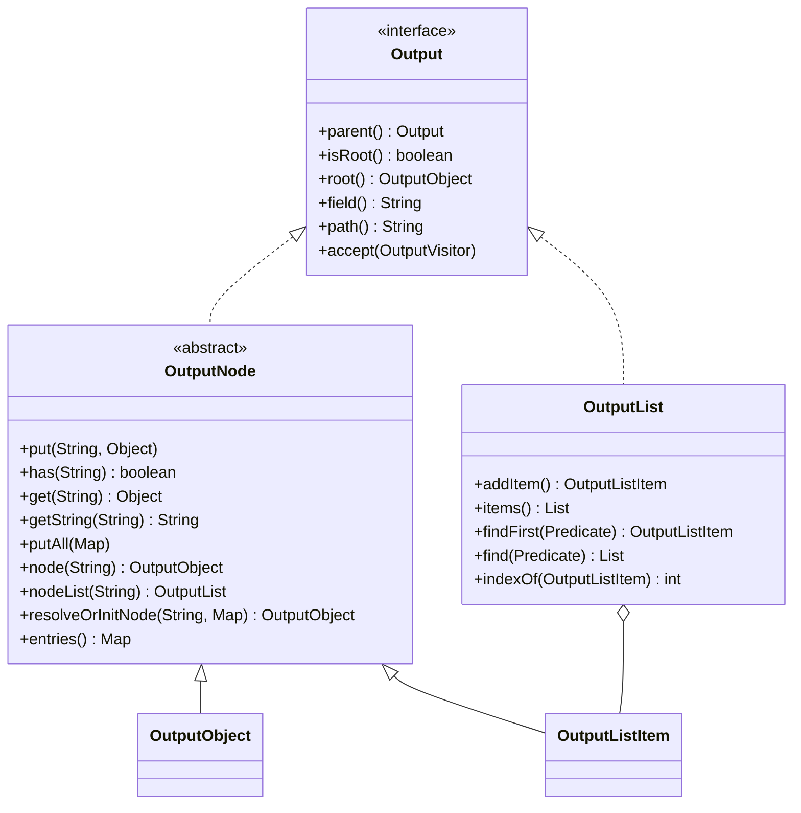

# OutputNode

> **Type:** Reference
> **Role:** Target data structure of the aggregation.
> **Behavior:** Hierarchical container into which aggregators write their results.

## What is an OutputNode?

An `OutputNode` is the **new, composed data structure** that results from the aggregation.
It is the counterpart to the Resolver: while a Resolver represents the *read* side, an
OutputNode represents the *write* side.

An OutputNode is always **hierarchical**: it can contain values, lists and further `OutputNode`
instances. This is precisely what gives rise to deeply nested structures of the kind typically
passed to frontends, search indexes or renderers.

While Resolvers are an *abstract* view onto arbitrary sources (CMS, Map, JSON, …), an
OutputNode is a **concrete target structure defined by the framework**. This is also reflected in
the name: the source parameter is simply called `Resolver` (it can be anything), while the
target structure carries the `Node` suffix because it always represents a node within the
hierarchy to be created.

## Class hierarchy



## Characteristics

- **Hierarchical:** An OutputNode can contain any number of child nodes and values.
- **Writable:** Aggregators write values, objects or lists under keys (field names)
  into the node – via `put(field, value)`, `node(field)` or `nodeList(field)`.
- **Readable:** `has(field)` checks existence, `get(field)` returns the raw value, `getString`
  converts it to a String. `resolveOrInitNode` creates a child node with default values,
  if it does not yet exist.
- **Navigable:** Every node knows its path (`path()`) and its field name (`field()`)
  within the parent node.
- **Composable:** Sub-aggregators receive their own (child) OutputNode and populate it
  independently. This is how nested structures arise without global state.
- **Rendering-neutral:** The OutputNode describes **structure**, not **format**. From the same
  structure, different representations (JSON, PHP, Map, …) can later be generated.
- **Result carrier:** Once the aggregation is complete, the OutputNode is the representation of the
  generated data structure.

## Example

```java

@Override
public void aggregate(Resolver source, OutputNode output) {
    // Simple value
    output.put("headline", source.value("sp_headline").asText());

    // Complex domain object via an assembler
    linkListAssembler.assemble(LinkListRequest.of(source, options), null)
            .ifPresent(linkList -> output.put("linkList", linkList));

    // Nested sub-OutputNode (e.g. filled by a sub-aggregator)
    OutputObject meta = output.node("meta");
    metaAggregator.aggregate(source, meta);
}
```

## Distinctions

- An OutputNode is **not a source** – during the aggregation run it is not read from, only
  written to.
- An OutputNode is **not a domain object** – it is generic and can hold arbitrary values.
- An OutputNode is **neither a DOM nor a serialization format** – it only describes the abstract
  structure of the result.
- An OutputNode **stores** whatever is written to it, empty or not – emptiness does not affect the
  tree. Empty values (and nested nodes that become empty) are dropped later, when a
  [Visitor renders the tree](visitor.md#dropping-empty-values-outputkeepifempty), not on write.
